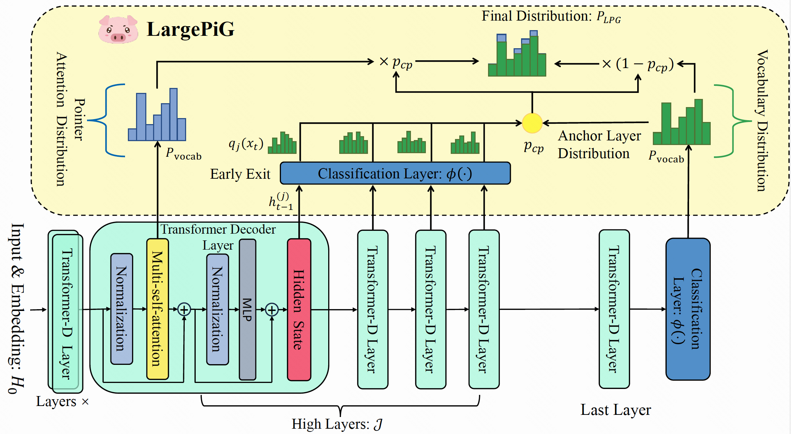

# LargePiG

The implementation of the paper: "LargePiG: Your Large Language Model is  Secretly a Pointer Generator"

Recent research on query generation has focused on using Large Language Models (LLMs), which despite bringing state-of-the-art performance, also introduce issues with hallucinations in the generated queries. In this work, we introduce relevance and factuality hallucination as a new typology for hallucination problems brought by query generation based on LLMs. We propose an effective way to separate content from form in LLM-generated queries, which preserves the factual knowledge extracted and integrated from the inputs and compiles the syntactic structure, including function words, using the powerful linguistic capabilities of the LLM. Specifically, we introduce a model-agnostic and training-free method that turns the **Large** Language Model into a **P**o**i**nter-**G**enerator (**LargePiG**), where the pointer attention distribution leverages the LLM's inherent attention weights, and the copy probability is derived from the difference between the vocabulary distribution of the model’s high layers and the last layer. To validate the effectiveness of LargePiG, we constructed two datasets for assessing the hallucination problems in query generation, covering both document and video scenarios. Empirical studies on various LLMs demonstrated the superiority of LargePiG on both datasets. Additional experiments also verified that LargePiG could reduce hallucination in large vision language models and improve the accuracy of document-based question-answering and factuality evaluation tasks.



# Dataset

Unzip the below datasets and put them in the corresponding folder.

The TruthfulVQG can be downloaded from [TruthfulVQG](https://drive.google.com/file/d/1TjVr79wtrbifdZsk-004f21EjiQBX2Im/view?usp=sharing).

The TruthfulDQG can be downloaded from [TruthfulDQG](https://drive.google.com/file/d/1N-Szm-d6oiigFWaMrjNFGz-HhUhlFkga/view?usp=sharing).


# Run Experiment Examples

**TruthfulVQG+LLaMA**
```bash
bash run_video_llama.sh
bash run_video_llama_largepig.sh
```

**TruthfulVQG+Qwen**
```bash
bash run_video_qwen.sh
bash run_video_qwen_largepig.sh
```

**TruthfulDQG+LLaMA**
```bash
bash run_document_llama.sh
bash run_document_llama_largepig.sh
```

**TruthfulDQG+Qwen**
```bash
bash run_document_qwen.sh
bash run_document_qwen_largepig.sh
```


# Requirements

**Important**
```bash
pip install -e transformers 
```

Others see [requirements.txt](requirements.txt)


# The quickstart of LargePiG


```python
import torch
from transformers import AutoModelForCausalLM, AutoTokenizer

model = AutoModelForCausalLM.from_pretrained(
    "Qwen/Qwen1.5-7B-Chat",
    device_map="auto",
    torch_dtype=torch.float16
)
tokenizer = AutoTokenizer.from_pretrained("Qwen/Qwen1.5-7B-Chat")

messages = [
    {"role": "system", "content": "You are a helpful assistant."},
    {"role": "user", "content": {input}}
]
text = tokenizer.apply_chat_template(
    messages,
    tokenize=False,
    add_generation_prompt=True
)

model_inputs = tokenizer([text], return_tensors="pt").to(device)


start_p = 10 # start of the copy content, for example 10
end_p = 100 # end of the copy content, for example 100

generated_ids = model.generate(
    model_inputs.input_ids,
    max_new_tokens=256,
    largepig_decoding=True,
    mature_layer=32,
    anchor_layer=None,
    candidate_layers=[26,28,30],
    pointer=True,
    only_pointer=True,
    output_scores=True, return_dict_in_generate=True, output_attentions=True,
    scale_value=100,normalization=False,start_p=start_p,end_p=end_p
).sequences


generated_ids = [
    output_ids[len(input_ids):] for input_ids, output_ids in zip(model_inputs.input_ids, generated_ids)
]

response = tokenizer.batch_decode(generated_ids, skip_special_tokens=True)[0]
print(response)
```


# Reference Repositories
We would like to extend our heartfelt thanks to the developers of the following projects for their valuable code references:

- [zero_shot_cot](https://github.com/kojima-takeshi188/zero_shot_cot)
- [TruthfulQA metrics.py](https://github.com/sylinrl/TruthfulQA/blob/main/truthfulqa/metrics.py)
- [TruthfulQA utilities.py](https://github.com/sylinrl/TruthfulQA/blob/main/truthfulqa/utilities.py)
- [DoLa](https://github.com/voidism/DoLa)


